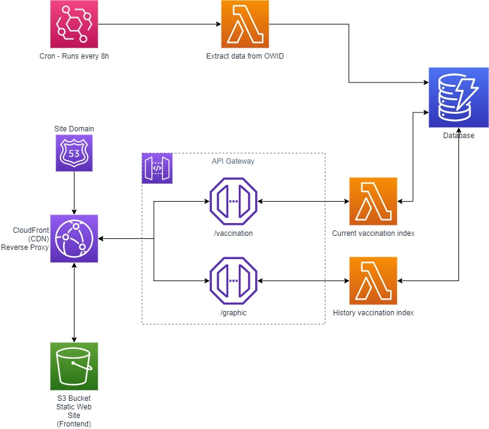

# 

Projeto que coleta dados sobre vacinação no Brasil e divulga em um website. | Project to collect Brazil vaccination data and presents in website.

## Proposta | Purpose

A proposta do projeto é apresentar, de maneira simples e direta, os dados de vacinação do Brasil e do mundo. Os dados são coletados do portal [Our World In Data](https://ourworldindata.org/covid-vaccinations) e armazenados em um banco de dados próprio da aplicação. Estes dados são coletados com um intervalo de 8 horas, resultando em três coletas por dia.

The project purpose is, in the simple way, present the data about vaccination in Brazil and in the World. The data are collected from [Our World In Data](https://ourworldindata.org/covid-vaccinations) and stored in the application's database. This data are collected considering an 8 hours interval - three collects per day.

## Tecnologias | Technologies

O projeto utiliza basicamente serviços AWS Serverless. Está dividido em três partes:

- Data Extract
   - Utiliza uma função AWS Lambda extrair os dados da fonte e armazená-los no serviço AWS DynamoDB.
   - Linguagem Python 3.8 e biblioteca Pandas.
- API
   - Utiliza o serviço AWS API Gateway para servir endpoints. Estes endpoints são resolvidos por funções AWS Lambda que consultam os dados no AWS DynamoDB.
   - NodeJS 12.x
- Brasil Vacinado Web
   - Projeto Web responsável por apresentar os dados coletados. Hospedado no serviço AWS S3 e servido por meio do serviço AWS CloudFront (CDN)
   - JavaScript e VueJS 3

Todo o projeto foi desenvolvido utilizando templates de infraestrutura como código, como AWS SAM - Serverless Application Model e CloudFormation.

------

The project basically uses Serverless AWS Services. Is divided into three parts:

- Data Extract
   - Uses a AWS Lambda Function to extract the data from the source and store them in AWS DynamoDB.
   - Python 3.8 language and Pandas library.
- API
   - Uses the AWS API Gateway service to serve endpoints. These endpoints are resolved by AWS Lambda Functions that get the data from AWS DynamoDB.
   - NodeJS 12.x.
- Web App - Brasil Vacinado
   - Web app responsible for present the collected data. The app are hosted on AWS S3 service and served by AWS CloudFront (CDN).
   - JavaScript and VueJS 3.

The whole project was developed using infrastructure as a code templates, like AWS SAM - Serverless Application Model and CloudFormation.

## Arquitetura | Architecture



## How to execute

### Pré-requisitos | Pre-requisits

- Python 3.8
- NodeJS 12.x
- AWS CLI v2
- AWS SAM - Serverless Application Model CLI
- Docker
- Nginx (Local tests)

### Database DynamoDB

- Locally

   To create a DynamoDB Container for local tests, run the command below

   `docker-compose up -d dynamo`

   To create local DynamoDB tables, install the [NoSQL Workbench](https://docs.aws.amazon.com/amazondynamodb/latest/developerguide/workbench.settingup.html) tool from AWS.

   - Open NoSQL Workbench, launch Amazon DynamoDB.
   - Go to **Data Modeler** menu item.
   - Import the file `./metadata/BrasilVacinado.json`
   - Go to **Visualizer** menu item, click in Commit to Amazon DynamoDB
   - Create a local connection using hostname as `localhost` and port `8000`

- AWS / Remote

   Run the command, answer the questions and save a file named `dynamodb.toml`.
   **Important: The stack name defined will be used as parameter to another stacks. Save the stack name or log in your AWS account and check the stack name in AWS CloudFormation  service.**

   `sam deploy -t dynamodb.yml --guided`

   This command will deploy the DynamoDB database. The next times you could use the `dynamodb.toml` file instead `--guided` parameter. Use `--config-file dynamodb.toml` for this.

### Data Extract

We need to use Docker to generate the files that are used by Pandas layer on AWS Lambda function

Go to folder `lib` inside `data-extract`:

`cd data-extract/lib/`

Run the commands below:

```
docker build . -t pandas-layer
docker run --rm -it -v "$(pwd):/data" pandas-layer cp -r /packages/pandas-python-3.8/ /data
```

The files for Pandas were generated. Back to `data-extract` folder and run the build:

```
cd ..
sam build -t ./lambda.yml
```

- Locally

   Run the command below to invoke the function locally

   `sam local invoke BrasilVacinadoDataExtractFunction -t ./lambda.yml --env-vars env.json --docker-network brasilvacinado-backend`

- AWS / Remote

   Run the following commands, answer the questions and save a file named `lambda.toml`:

   `sam deploy -t lambda.yml --guided`

   This command will deploy the lambda function to extract the data. The next times you could use the `lambda.toml` file instead `--guided` parameter. Use `--config-file lambda.toml` for this.

### API

Go to the folder `api`:

`cd api/`

Run the command:

```
npm install
sam build
```

- Locally

  Run the command below to start a REST API locally at `http://localhost:3000`

  `sam local start-api --docker-network brasilvacinado-backend --env-vars env.json`

- AWS / Remote

   Run the command below for deploy the API Gateway to AWS:

   `sam deploy`

### Web App

Go to the `brasilvacinadoweb` folder:

`cd brasilvacinadoweb/`

Run the command:

`npm install`

- Locally

   Run the command `npm run serve` to start a local server serving the application.

   Run the command `nginx -c nginx.conf`. This command starts a reverse proxy for frontend requests reach your Local Lambda API started at the last step.

   Access the address `http://localhost:8888`

- Production

   Run the command `npm run build`. A folder named `dist` will be created. You could serve the application using your preferred server.
